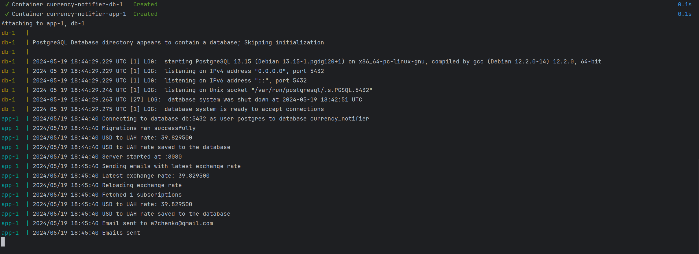
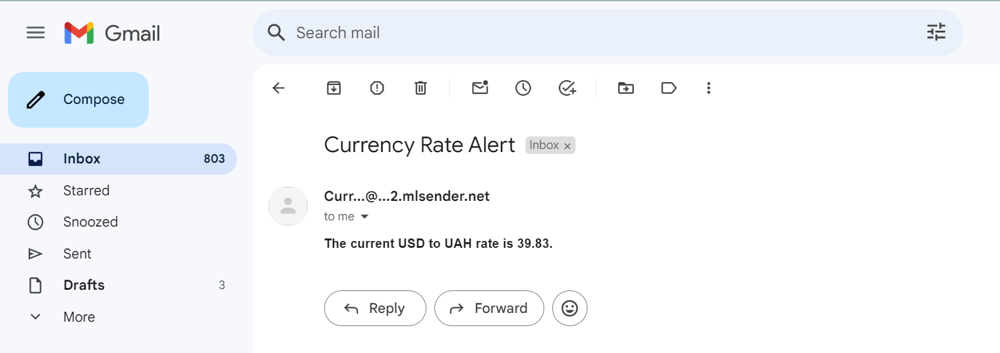

# How to run

Firstly you need to fill some secrets in the `.env` file.
Basically there are:

1) `SMTP_HOST` - the host of the SMTP server
1) `SMTP_PORT` - the port of the SMTP server
1) `SMTP_USERNAME` - the username of the SMTP server
1) `SMTP_PASSWORD` - the password of the SMTP server
1) `SMTP_FROM_EMAIL` - the email from which the service will send emails

I find it not a good idea to store secrets in the repository, so I decided to just left
placeholders in the `.env` file.

Like this:

```env
SMTP_HOST=<secret-data>
SMTP_PORT=<secret-data>
SMTP_USERNAME=<secret-data>
SMTP_PASSWORD=<secret-data>
SMTP_FROM_EMAIL=<secret-data>

```

Then just run

```bash
docker-compose build
docker-compose up
```


_An example of command logs_

# Examples


_An example of email message from the service_

# Architecture

## Currency rate provider

I choose [Monobank Open API](https://api.monobank.ua/docs/index.html) as a currency rate
provider. That decision has been taken because comparing to other currency rate providers
monobank has some benefits:

1) It's free, no payments, no subscriptions
2) No API key is required

For sure, there are some drawbacks as well:

1) Monobank does not allow to send as many requests as you want. There is a limit

So because of that drawback, I decided to implement a cache mechanism.
The cache is simple, and it stores the currency rate for 1 hour.
So it means that it does not matter how many requests you send to the service,
an actual request to the monobank API will be sent only once per hour.

Using cron job the service sends a request to the monobank API every hour and updates the cache.

## Mail service

I choose [Mailersend](https://mailersend.com/) as a mail service provider.
That decision has been taken because comparing to other mail service providers
Mailersend has some benefits:

1) There is free plan, without adding a credit card
2) No phone number is required to register

However, there are some drawbacks as well:

1) Mailersend does not provide go library, so I had to use the SMTP protocol to send emails

## Asynchronous processing

I decided to use cron for asynchronous processing. There are 2 cron jobs:

1) Update currency rate cache
2) Send emails

#### Update currency rate cache

Every hour the service sends a request to the monobank API and updates the cache.

#### Send emails

Every day service sends an email with the currency rate to the user.
It uses the latest currency rate from the cache.